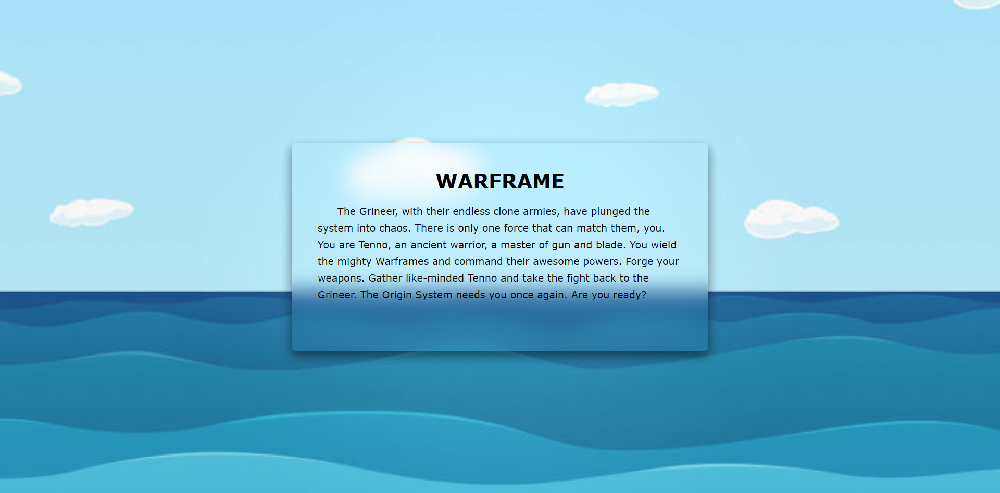

<!--
 * @Author: Li Jian
 * @Date: 2020-07-31 09:18:52
 * @LastEditTime: 2020-07-31 09:44:41
 * @LastEditors: Li Jian
 * @Description: 
 * @FilePath: /TcTOrz.github.io/_posts/2020-07-31-css-use.md
 * @Motto: MMMMMMMM
--> 
---
layout: post
title: 一些css特效
categories: [html, css]
description: 自己遇见的一些小功能
keywords: Html, css
topmost: false
---

项目中遇到的一些css特效，记录下来以防止忘记。

### 毛玻璃效果
原文作者找不到了，sry。

```html

<html>
<head>
	<meta http-equiv="pragma" content="no-cache"> 
    <meta http-equiv="Cache-Control " content="no-cache,must-revalidate"> 
    <meta name="description" content="">
    <meta http-equiv="content-type" content="text/html; charset=UTF-8" />
    <meta name="viewport" content="width=device-width, user-scalable=no, initial-scale=1, maximum-scale=1">
	<title>WARFRAME</title>
	<link rel="stylesheet" href="./style.css">
</head>
<body>
	<div class="container">
		<div class="content">
			<h1>WARFRAME</h1>	
			<p>The Grineer, with their endless clone armies, have plunged the system into chaos. There is only one force that can match them, you.
			You are Tenno, an ancient warrior, a master of gun and blade. You wield the mighty Warframes and command their awesome powers. Forge your weapons. Gather like-minded Tenno and take the fight back to the Grineer. The Origin System needs you once again. Are you ready?</p>	
		</div>
	</div>
<!-- <script src="/static/bundle.js"></script> -->
</body>
</html>

```

```css

/* style.css */
html, body, div, h1, h2, h3, h4, h5, h6, p, span, img, input {
	margin: 0;
	padding: 0;
}

html, body {
	font-size: 19px;
	font-family: 'Verdana','Arial';
	/* color: rgba(0,0,0,0.8); */
}

.container {
	width: 100%;
	height: 100%;
	position: relative;
	background-image: url(./login.jpg);
	background-position: center top;
	background-size: cover;
}

.content {
	width: 800px;
	height: 400px;
	position: absolute;
	top: 50%;
	left: 50%;
	margin-top: -200px;
	margin-left: -400px;
	border-radius: 8px;
	box-shadow: 0 10px 20px rgba(0,0,0,0.5);
	overflow: hidden;
	z-index: 2;
	padding: 50px;
	box-sizing: border-box;
}

.content::before {
	content: '';
	position: absolute;
	top: 0;
	left: 0;
	right: 0;
	bottom: 0;
	-webkit-filter: blur(20px);
	-moz-filter: blur(20px);
	-ms-filter: blur(20px);
	-o-filter: blur(20px);
	filter: blur(20px);
	z-index: -3;
	margin: -30px;
	background-image: url(./login.jpg);
	background-position: center top;
	background-size: cover;
	background-attachment: fixed;
}

.content h1 {
	text-align: center;
	margin-bottom: 20px;
}

.content p {
	text-indent: 2em;
	line-height: 1.7;
}

```

- 效果图
